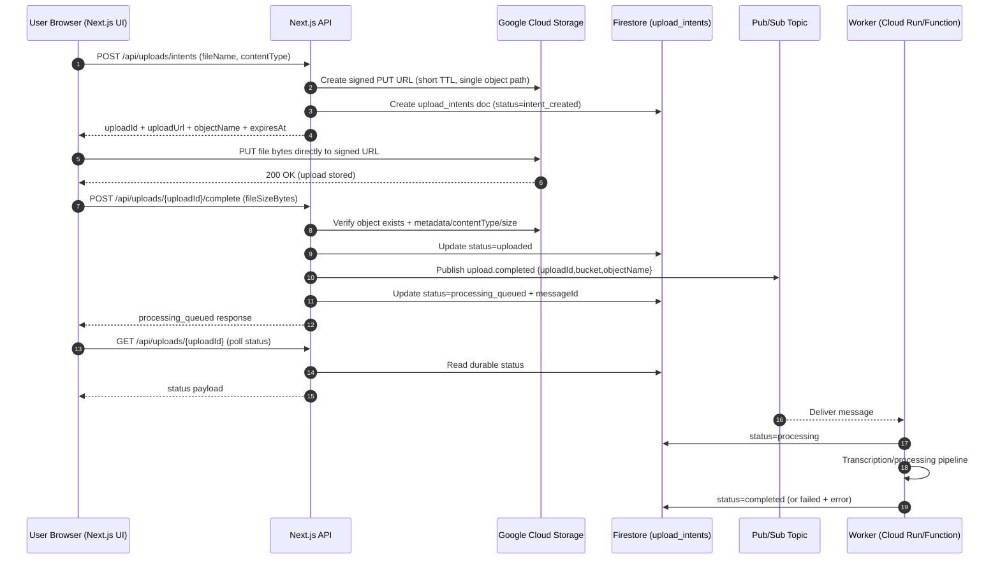
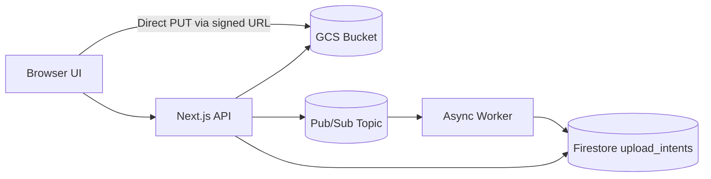

# System Architecture Diagram

## Notes

- Audio bytes do not pass through your Next.js server.
- Upload state is durable in Firestore.
- Async processing is decoupled via Pub/Sub + worker.
- User-facing status comes from polling `GET /api/uploads/{uploadId}`.
